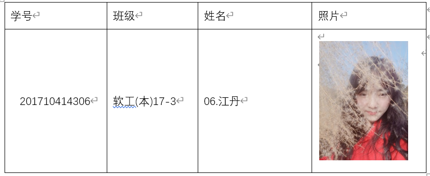
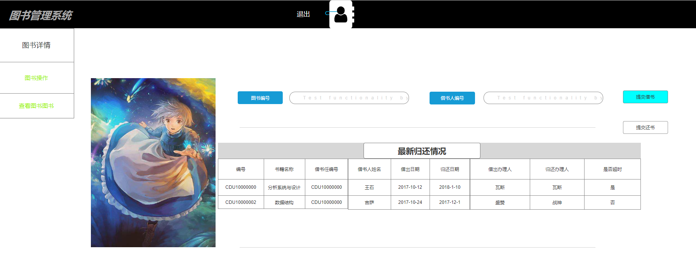

# 实验5:图书管理系统数据库设计与界面设计
|学号|班级|姓名|照片|
|:-------:|:-------------: | :----------:|:---:|
|201710414306|软件(本)17-3|6.江丹||
## 1.数据库表设计

## 1.1. 图书表(BookVarieties)
|字段|类型|主键，外键|可以为空|默认值|约束|说明|
|:-------:|:-------------:|:------:|:----:|:---:|:----:|:-----|
|bookID|varchar2(20)|主键|否|||CDU+编号|
|bookName|varchar2(20)| |否||||
|author|varchar2(15)| |否||||
|bokPress|varchar2(30)| |否||||
|bokStorage|varchar2(30)| |否||||
|bookPrice|varchar2(30)| |否||||
|PublicaDay|datetime(20)| |否||||
|bookDescry|varchar2(100)| |否||||
|bookState|varchar2(20)| |否||||

 ### 表介绍：书号、书名、作者、出版社、价格、库存量、简介、状态，其中书号为主键

## 1.2. 读者表(Readers)
|字段|类型|主键，外键|可以为空|默认值|约束|说明|
|:-------:|:-------------:|:------:|:----:|:---:|:----:|:-----|
|readerID|integer(20)|主键|否||||
|readerName|varchar2(20)| |否||||
|readerSex|varchar2(20)| |否||||
|readPhone|int(11)| |否||||
|readSystem|varchar2(20)| |否||||
|takeffectDay|datetime(20)| |否||||
|invalidDay|datetime(20)| |否||||
|Booklimit|integer(20)| |否||||

 ### 表介绍：读者号、姓名、性别、电话、所在系、生效日期、失效日期、借书量限额，其中读者号为主键

## 1.3. 借阅表(BorrowingRecords)
 |字段|类型|主键，外键|可以为空|默认值|约束|说明|
 |:-------:|:-------------:|:------:|:----:|:---:|:----:|:-----|
 |bookID|varchar2(20)|主键|否|||CDU+编号|
 |bookName|varchar2(20)| |否||||
 |readerID|integer(20)|外键|否||||
 |readerName|varchar2(20)| |否||||
 |borrowDay|datetime(20)| |否||||
 |returnDay|datetime(20)| |否||||
 |realreturn|datetime(20)| |否||||
 |renew|varchar2(20)| |否||||

 ### 表介绍：书号、书名，读者号、姓名，借阅日期、应还日期、真实还书日期、是否续借，其中书号为主键、读者号为外键，一个书可以被多个读者借阅为一对多关系

## 1.4. 图书管理员表(adminBook)
|字段|类型|主键，外键|可以为空|默认值|约束|说明|
|:-------:|:-------------:|:------:|:----:|:---:|:----:|:-----|
|adminID|integer(20)|主键|否||||
|adminName|varchar2(100)| |否||||
|readerID|integer(20)|外键|否||||
|bookID|varchar2(20)|外键|否|||CDU+编号|

 ### 表介绍：职工号，图书管理员姓名，读者号，书号，职工号为主键，读者号，书号为外键，图书管理员可以管理读者和书为一对多关系

## 1.5. 系统管理员表(SystemAdmin)
|字段|类型|主键，外键|可以为空|默认值|约束|说明|
|:-------:|:-------------:|:------:|:----:|:---:|:----:|:-----|
|systemID|integer(20)|主键|否||||
|readerID|integer(20)|外键|否||||
|adminID|integer(20)|主键|否||||

 ### 表介绍：读者ID(readerID),图书管理员ID(adminID)系统管理员ID(systemID)，一个系统管理员负责整个系统的维护等对应多个图书管理员或读者用户

## 1.6. 预定表(ScheduledRecord)
 |字段|类型|主键，外键|可以为空|默认值|约束|说明|
 |:-------:|:-------------:|:------:|:----:|:---:|:----:|:-----|
 |bookID|varchar2(20)|主键|否|||CDU+编号|
 |bookName|varchar2(20)| |否||||
 |readerID|integer(20)|外键|否||||
 |readerName|varchar2(20)| |否||||
 |scheduledDay|datetime(20)| |否||||
 |scheduleState|varchar2(20)| |否||||

  ### 表介绍：书号、书名，读者号、姓名，预定日期，预定状态，书号为主键，读者号为外键，一本书可以被多人预定为一对多关系

 ## 1.7. 逾期记录表(Overduerecords)
  |字段|类型|主键，外键|可以为空|默认值|约束|说明|
  |:-------:|:-------------:|:------:|:----:|:---:|:----:|:-----|
  |readerID|integer(20)|主键|否||||
  |readerName|varchar2(20)| |否||||
  |bookID|varchar2(20)|主键|否|||CDU+编号|
  |bookName|varchar2(20)| |否||||
  |overdueDays|datetime(20)| |否||||
  |overdueFine|varchar2(20)| |否||||

   ### 表介绍：读者号、姓名，书号、书名，逾期天数，逾期1罚款数目，读者号为主键，书号为外键

***

## 2. 界面设计
## 2.1. 借书界面设计

- 用例图参见：借书用例
- 类图参见：借书类，读者类，
- 顺序图参见：借书顺序图
- API接口如下：

1. 获取全部分类

- 功能：用于获取全部分类
- 请求地址： http://[YOUR_DOMAIN]/v1/api/shop_cate
- 请求方法：POST
- 请求参数：

|参数名称|必填|说明|
|:-------:|:-------------: | :----------:|
|access_token|是|用于验证请求合法性的认证信息。 |
|method|是|固定为 “GET”。|

- 返回实例：
```
{
    "info": "感谢您的支持。",
    "data": {
        "nickname": "O记_Mega可达鸭",
        "uid": "14361",
        "signature": "呀  一不小心就进化了",
        "score1": "322",
        "real_nickname": "O记_Mega可达鸭",
        "title": "Lv3 转正",
        "avatar128": "http://upload.opensns.cn/Uploads_Avatar_14361_58e4b58fccf81.jpg?imageMogr2/crop/!260x260a6a22/thumbnail/128x128!",
        "avatar512": "http://upload.opensns.cn/Uploads_Avatar_14361_58e4b58fccf81.jpg?imageMogr2/crop/!260x260a6a22/thumbnail/512x512!"
    },
    "code": 200
}
```
- 返回参数说明：

|参数名称|说明|
|:-------:|:-------------: |
|Info|返回信息|
|data|用户的个人信息|
|dodo|返回码|

2. *******API
- 功能：用于获取全部分类
- 请求地址： http://[YOUR_DOMAIN]/v1/api/shop_cate
- 请求方法：POST
- 请求参数：

|参数名称|必填|说明|
|:-------:|:-------------: | :----------:|
|access_token|是|用于验证请求合法性的认证信息。 |
|method|是|固定为 “GET”。|

- 返回实例：
```
{
    "info": "感谢您的支持。",
    "data": {
        "nickname": "O记_Mega可达鸭",
        "uid": "14361",
        "signature": "呀  一不小心就进化了",
        "score1": "322",
        "real_nickname": "O记_Mega可达鸭",
        "title": "Lv3 转正",
        "avatar128": "http://upload.opensns.cn/Uploads_Avatar_14361_58e4b58fccf81.jpg?imageMogr2/crop/!260x260a6a22/thumbnail/128x128!",
        "avatar512": "http://upload.opensns.cn/Uploads_Avatar_14361_58e4b58fccf81.jpg?imageMogr2/crop/!260x260a6a22/thumbnail/512x512!"
    },
    "code": 200
}
```
- 返回参数说明：

|参数名称|说明|
|:-------:|:-------------: |
|Info|返回信息|
|data|用户的个人信息|
|dodo|返回码|